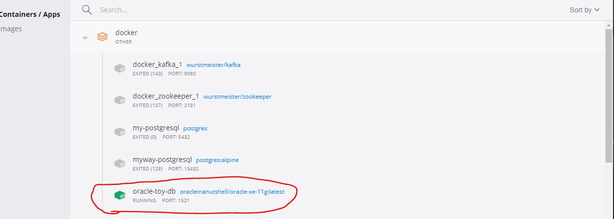

# Moving-Out

## Application 환경정보
* Java 11 ver
* Spring boot 2.5.4
* maven
* Oracle

## 모듈 구성
* 아래와 같이 Multi 모듈로 구성하였습니다.
```
moving-out(root)
  │ 
  └── moving-out-common
  │    - 모듈간 공통적인 기능(ex. DB 저장) 
  |    - 공통적인 비즈니스 처리 로직
  └── moving-out-api
  │    - 실제 Front-End와 API연동 및 서비스에 필요한 비즈니스 로직
  └── moving-out-admin
       - App 모니터링 및 설정 변경에 필요한 APM 서버
```

* 추후 Spring-batch 도입이 필요한 경우 별도 모듈로 추가 예정


## Docker로 Oracle DB 실행하기

> #### 로컬에 Oracle Express 서버 환경이 설치가 되신 분이라면 이 단계를 건너 뛰어도 상관 없습니다.
> * 설치 가이드(생활코딩-Oracle) : https://opentutorials.org/course/3885/26280

___

1. 각자 로컬 OS 환경에 맞는 Docker를 설치합니다.
    * windows10에서 Docker 설치하기 가이드 : https://www.lainyzine.com/ko/article/a-complete-guide-to-how-to-install-docker-desktop-on-windows-10/

2. 해당 프로젝트의 docker 폴더에 Command 창을 열고 아래와 같은 명령어를 칩니다.
```
docker-compose up -d
```


3. 아래와 같이 컨테이너 인스턴스가 올라가는 것을 확인해봅니다.

   * 혹은 ```docker ps``` 명령어로 확인 가능합니다.
   * 

4. 예기치 않은 이유로 도커에 뜬 컨테이너를 초기화 시키고 싶을때 는 아래 명령어를 칩니다.(같은 디렉토리에서 실행하셔야 합니다.)
```
docker-compose down -v
```